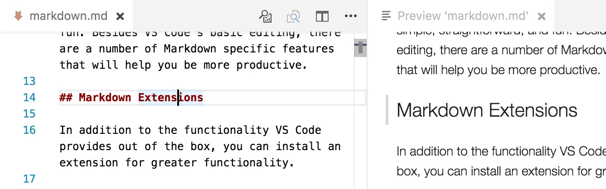

這篇教學示範如何輕易地打造適合程式開發者使用的 Markdown 編輯環境，以及透過 Python 撰寫簡單的自動化工具，協助你將 Markdown 文件轉換為 HTML 與 PDF 格式。通常我們會在專案中使用 Markdown 撰寫 README 等開發文件，有時這份文件需要先經過轉檔，以方便列印或作為電子郵件的附件，交給專案的其他人員例如專案經理或客戶。

本篇需要用到的工具有：

1. Visual Studio Code (VSCode)
2. Python 3.x
3. Google Chrome

VSCode 本身已經對 Markdown 文件編輯有良好的支援，但是你可以參考官方的這份說明，瞭解更多關於 Markdown 的實用技巧。

https://code.visualstudio.com/docs/languages/markdown

其中我們推薦：

* 加裝 markdownlint 套件，它可以 ~~強迫~~ 建議你撰寫出更好的風格。
* 瞭解 Preview 功能的操作，方便你在編寫 Markdown 代碼的同時，顯示網頁版本的輸出預覽。



Python 具有易學易用的特性，我們只需要找到合適的套件，就能輕鬆處理 Markdown 的轉換。

Python-Markdown

https://github.com/Python-Markdown/markdown

使用 `pip` 安裝 Python-Markdown 套件。

``` bash
pip install markdown
```

撰寫 `README.md`

使用 Python 的檔案讀寫，完成一個簡單的範例。

``` python
import markdown

with open('README.md', 'r') as f:
    html = markdown.markdown(f.read())

with open('README.html', 'w') as f:
    f.write(html)
```

或使用一行完成檔案讀寫。

``` python
import markdown

markdown.markdownFromFile(input='README.md', output='README.html')
```

使用 Chrome Headless 進行 HTML 轉檔 PDF 的處理，其中 Google Chrome 瀏覽器的執行路徑 `/Applications/Google\ Chrome.app/Contents/MacOS/Google\ Chrome` 是 macOS 的安裝位置，如果使用其他作業系統需自行替換。

``` python
import os
import markdown

markdown.markdownFromFile(input='README.md', output='README.html')
os.system('/Applications/Google\ Chrome.app/Contents/MacOS/Google\ Chrome --headless --run-all-compositor-stages-before-draw --print-to-pdf-no-header --print-to-pdf=README.pdf --disable-gpu README.html')
```

這樣就能打造一個最簡單的 Markdown to HTML / PDF 轉檔工具，當然這還是一個功能相當陽春的實作，你可以再添加更多自己想要的功能，目前全世界也有非常多軟體開發者，製作出各式各樣基於 Markdown 格式的便利工具。

延伸學習

* [Getting Started with Headless Chrome](https://developers.google.com/web/updates/2017/04/headless-chrome)
* [Python-Markdown Extensions](https://python-markdown.github.io/extensions/)
* [PyMdown Extensions](https://facelessuser.github.io/pymdown-extensions/)
* [Pandoc](https://pandoc.org/) 支援眾多格式的文件轉檔工具。
* [MkDocs](https://www.mkdocs.org/) 使用 Markdown 生成美觀的專案文件。
* [Jekyll](https://jekyllrb.com/) 使用 Ruby 撰寫的靜態網站產生器。
* [Hugo](https://gohugo.io/) 強調速度與彈性的靜態網站產生器。
* [Hexo](https://hexo.io/) 是一個快速、簡單且強大的網誌框架。Hexo 使用 Markdown（或其他標記語言）解析您的文章，並在幾秒鐘內，透過漂亮的主題產生靜態檔案。
* [Hyde](https://hyde.github.io/) 使用 Python 開發的靜態網站產生器。