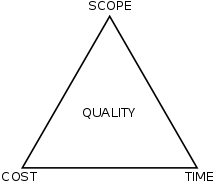

愈來愈多企業投入大量預算開發軟體，但你知道軟體專案的成功率有多少嗎？

事實是只有「四成不到」的專案取得順利成功，大約兩成徹底失敗。

關鍵字「The Standish Group Report Chaos」

美國權威機構史丹德需集團（Standish Group）長期追蹤觀察資訊專案成功率，請搜尋相關資料，瞭解軟體專案失敗的常見因素有哪些？

作為軟體工程師，我們的責任在於協助專案經理（Project Manager 簡稱 PM）或產品經理（Product Manager 簡稱也是 PM）交付符合最終用戶需求的軟體，專案管理（Project Management）不只是 PM 的責任，而是所有專案參與成員都必須共同積極參與並解決問題，才有機會提高軟體專案成功率。

許多優秀軟體工程師在職場上獲得很好的成就，也為自己創造優渥的收入，他們的共通點是：經歷過許多成功專案。失敗固然可以留下一些經驗，但如果履歷表只是累積許多年資，看不到吸引伯樂的成功經驗，相對要獲得理想的工作就會困難許多。

因此我們在瞭解軟體專案常見失敗原因的同時，更需要探討軟體專案如何成功。

成功的軟體專案，關鍵不是用了多麼酷炫的新技術，或實現多困難的功能，而是靠著「務實」的團隊成員，藉著「熟練」的開發流程，打造出實際能解決問題、滿足用戶需求的軟體。

現實世界的軟體專案相當複雜，而且只會愈來愈複雜，但無論影響專案的因素有多少，任何軟體專案都具有三個基本要素，也就是所謂 Triple Constrain（專案金三角）。

* Scope 範疇
* Time 時間
* Cost 成本

職場中難免許多總是抱怨不停的軟體工程師，最常見的抱怨例如：

1. 上線時程怎麼這麼趕
2. 客戶給的預算也太少了吧
3. 只給得起香蕉就別怪我是猴子
4. 為什麼不能用那個很酷的 OOO 技術改寫這個系統
5. PM 為什麼都亂答應需求
6. 前人也留下太多技術債了吧
7. 以及很多你已經聽過或還沒聽過的⋯⋯

現實的職業生涯中，難免會遭遇到各種問題，但是優秀的軟體工程師不會只是抱怨，更多的時候是捲起袖子動手解決問題，不斷累積自己的「Credit」，客戶或公司願意付你多少錢，其實關鍵不在於你的技術能力有多強大，而是你能為他們解決多少問題、創造多少價值。

專案金三角是個「硬邊界」的限制，因此身為軟體工程師，我們需要面對現實：

1. 永遠都有上線時程壓力，因為所有有機會成功的產品，都會面臨市場上眾多競爭者
2. 付錢的人永遠都會希望你愈快交貨愈好，就像你不會希望外送員遲了一天才給你餐點
3. 經常會有比你或你的團隊更快能把東西做好的第三者等著搶你飯碗
4. 付錢的人永遠希望功能愈多愈好、預算愈低愈好，就像你不會願意多付一倍價格去買功能減少一半的車子
5. 專案的總成本當然愈低愈好，專案有獲利才會有獎金，但前提是品質也必須能滿足交付要求
6. 使用更新的技術或許能帶來許多改善，但也隱藏許多看不見的成本，例如不斷踩雷導致需要加班甚至耽誤時程

世界上並不存在完美的專案，幸好成功的專案並不需要完美，只要做到各方都滿意，就可以稱得上成功：

1. 付錢的人滿意（軟體確實滿足他們的需求、為他們帶來收益）
2. 做事的人滿意（專案合作過程愉快、準時交付上線、不必經常超時工作、順利收錢）
3. 使用的人也滿意（軟體確實解決他們的問題、為他們帶來價值）

因此想要打造成功的軟體，並非把「程式開發」做得非常好，就可以讓所有人都滿意，專業的軟體開發團隊，會把整個研發流程分為多個階段，實際會因組織規模和企業文化而有所不同，但是大致上我們可以簡單歸納為：

1. 規劃 Planning
2. 設計 Design
3. 開發 Development
4. 部署 Deployment

這四個階段，有經驗的軟體工程師都可以在其中扮演具有影響力的角色，你認為身為一位軟體工程師，在這四個階段，你可以為專案做好哪些工作呢？