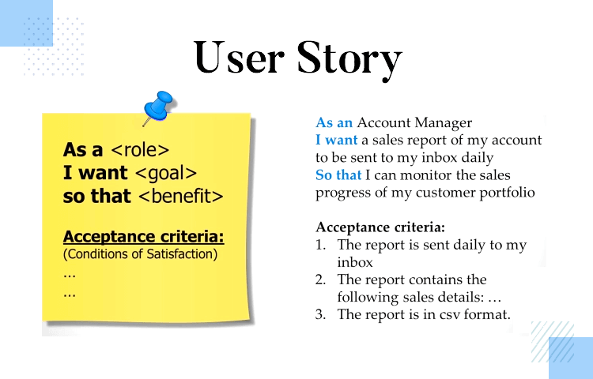

前言：

身為專案團隊中的成員，軟體工程師需要 Product ownership 與 Software craftsmanship 的職業精神，才能真正為公司創造價值。雖然你踏入職場的前幾年，可能沒機會真正參與一個新產品的誕生，也沒有太多發言權，收到清楚的規格能趕得上時程把它做出來，，但是你仍必須盡可能讓自己做好準備，直到屬於你的機會來臨時，你有能力帶給團隊更多有價值的貢獻。

請跟著 Monosparta 安排的任務，完成一次專案實作的練習。

## 新專案的誕生

在畢業後不久，你正在思考著自己下一步要做些什麼的時候，許久沒聯絡的大學好友「阿強」，突然打了通電話約你碰面。

強哥：「嘿，好久不見，有空嗎？找間猩芭客喝杯咖啡吧！」

記得在讀大學的時候，阿強就經常找你喝咖啡，因為他總是常有程式作業寫不出來，在你的幫忙之下才順利拿到必修學分。

在咖啡店碰面後，阿強已經幫你點好一杯冰拿鐵，還沒等你開口，阿強就迫不及待地打開話匣子。

強哥：「你聽過 ㄢ ㄌㄧˋ 嗎？」

「蛤？」

正當你的思緒準備要飛出外太空時。

強哥：「安力健身中心。」

「哦～車站前的巨大廣告牆，好像就是安力健身的廣告嘛！」

強哥：「對～就是那個安力！」

「我畢業到現在胖了快五公斤，剛好想找個健身房練練。」

強哥：「早說嘛！這張名片你留著，到隨便一家門市找他們經理，他就會給你一張永久會員卡。」

名片寫著，安力健康休閒俱樂部，總公司管理部，特助，王宇強。

聊著聊著，你才發現原來同窗四年的阿強，居然是安力連鎖健身集團的二代接班人，身家超過百億，平時他為人處事都刻意低調，一點也不像新聞上那些開跑車炫富的富二代。

阿強因為受到COVID19疫情影響，暫時取消出國深造的計畫，準備在未來兩年的時間，接手已經有三十年歷史的家族事業，負責推動集團內部的「數位轉型」任務。

強哥：「雖然COVID19讓我們三百家門市損失加起來超過三億，但是閒著沒事的教練們自己拍了幾支影片當起健身 YouTuber，沒想到因此收到很多粉絲留言説想要加入會員，甚至願意付費訂閱教學影片，對門市銷售的居家健身週邊產品也很有興趣，大股東們相當看好接下來的健身市場發展，紛紛表示有意願加碼投資。所以，我認為比繼續擴點更重要的事，會是把會員數位服務做好、改善用戶體驗。」

「怎麼說呢？門市生意不是一直都很不錯嗎？有什麼可以改善的地方嗎？」

強哥：「是啊～生意蒸蒸日上。但是負責電腦化管理的叔叔跟我爸年紀差不多，他已經快要退休，二十多年前他導入 EXCEL 軟體算是很成功，我們每家門市的會員資料，都在門市自己的電腦主機各自管理，再定期透過 Email 把 .xlsx 檔案寄回總公司信箱，最近新加入的會員數量太多，管理會員資料建檔的阿姨已經快受不了想離職了。」

「天啊～你們都沒有資料庫嗎？」

強哥：「他們認為 EXCEL 就是資料庫啦！」

「呃～要這樣說，好像也沒錯啦！」

強哥：「聽說你用 PHP 接過不少案子，PHP 適合開發一套俱樂部專用的會員資料庫嗎？」

「是沒問題～你希望做到哪些功能？」

強哥：「比如我希望新加入的會員，可以立即收到一封歡迎信，並且驗證他填的信箱是不是正確的。過去大概一百個會員會有3~5位會員，因為會員資料表上面的字跡不清楚，所以 Key 到電腦的 Email 一直都是錯的。」

「嗯嗯。」

強哥：「總公司也要用簡訊和 Email 寄出生日祝賀訊息，還有生日當月壽星會員專屬的優惠禮遇，我們已經聘請三位工讀生幫忙處理這件事，但經常還是有會員打電話客訴抱怨自己沒收到生日優惠。」

「聽起來工讀生也很苦逼。」

強哥：「會員如果太久沒來，我們的教練會打電話關心提醒，但會用使用記錄也是每間門市厚厚的紙本，再把整箱寄回總公司，這些資料堆滿一間倉庫。」

「只要在倉庫搬紙箱就可以健身啦～」

強哥：「是啊！我們倉庫工讀生的二頭肌結實得，可不輸給教練呢～」

「噗～」

強哥：「所以啊～大家認識這麼多年，我最近要成立數位化部門，你就來幫幫忙吧？」

原來阿強說的幫忙，是他們的數位化部門剛成立，需要先找一位 Team Lead，待遇還真不錯，年薪的數字好多個零，還有分紅。

阿強又拿出一疊會員的許願清單。

會員#000035917「每個月測量完體脂，那張報告就不知道扔哪去，希望可以用網站查詢自己的體脂報告、三個月變化，還有教練建議的飲食清單。」

會員#000013175「不是有會員卡嗎？為什麼鎖櫃還要自己準備鎖頭，卡片逼一下就開鎖不行嗎？每次都忘記帶鎖頭很煩。」

會員#000008416「會員權益修改都不用通知嗎？都沒收到資料是要怎麼知道你們又改了啥？」

聽說這份清單，還是從 Email 和 Facebook 留言中，一則一則手工整理出來的。

~ ~ ~ A Few Moments Later ~ ~ ~

回家思索片刻後，雖然你覺得這是一個想把握的好機會，如果能幫阿強把數位轉型做成功，你幫他在集團中締造亮眼成績單，你也能更快成為人生勝利組。

但是要扛下這責任也不容易，你需要在一天之內準備好資料，跟著阿強在明天的董事會提出初步構想。

首先，你需要先建立幾條 User Story，別擔心阿強講得不夠清楚，因為他已經準備好挑燈夜戰，你可以隨時問他任何問題，直到你把「安力健身中心」面臨數位轉型所遭遇到的問題，轉換成幾條關鍵且有價值的 User Story。

請參考 User Story 的撰寫範本，完成三條你認為最重要的 User Story，證明你就是那個促使數位轉型成功的幕後推手。

