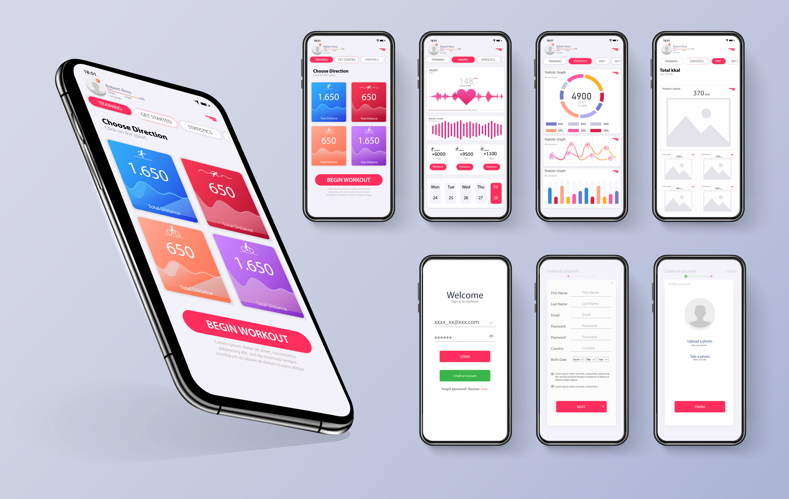

前言：

繪製 Wireframe 的階段，我們通常會以「低保真度」方式呈現頁面結構、功能與內容規劃，也就是非常簡單的線條、符號與框線，通常是黑白或灰階，因為在這個階段有許多不同領域背景的成員會參與，他們不一定熟悉複雜的設計工具，對美感也會有各自的審美觀與見解，Wireframe 也會在協作過程中反覆修改調整，甚至捨棄整批已經繪製好的畫面重新來過，因此 Wireframe 加入視覺風格並不會帶來好處。

直到 Wireframe 確認後，才會開始定義整體風格、加入視覺設計細節，此階段常用的工具有 Sketch、Adobe Xd 或 Figma，少數的設計師可能會沿用過去已經習慣使用的 Photoshop 或 Illustrator，但畢竟這類專業繪圖軟體並非針對 UI 設計用途，因此效率上可能大打折扣。

## 你就是沒有人

> 「不要問為何沒有人做這個，先承認你就是『沒有人』」。因為，「沒有人」是萬能的。
> 
> --- g0v 組織。

安力健身的數位化部門，似乎為這家三十年企業注入一股新的活力，其他部門都開始期待著新系統上線的那天，曾經許下的 User Story 願望能轉化為真實功能，

經過幾次反覆討論，在阿強與小美的協助確認其他部門的意見後，Wireframe 終於定案，可喜可賀。

強哥：「董事會很期待這個系統正式上線，但是時程一定要ASAP，因為我們最大的競爭對手，他們也想趕在下個月推出類似服務。」

小美：「聽說他們找的外包公司，曾經幫萵苣健身做過類似的系統。」

強哥：「新來的那幾位工程師手腳俐落嗎？」

「我們新招聘的幾位工程師，他們都是有幾年經驗的熟手。」

「只要趕快把設計稿完成，前端和後端同時進行開發，相信是有機會趕得上預定時程表。」

奇怪，這次的會議怎麼少了一個人？

「疑，阿芬今天沒來嗎？」

強哥：「這個...我們才剛要跟你提起這件事。」

小美：「阿芬她辦好離職手續了。」

「蛤？！」

強哥：「她覺得剛畢業就來我們公司，美編這工作做了好幾年，有點疲乏了，想先休息一陣子幫自己充電。」

小美：「她下個禮拜就要去日本打工度假，聽說至少會待上一、兩年。」

「難怪她下班後都在準備日檢。」

「上次不是有錄取一位新的 UI 設計師，他什麼時候會報到呢？」

小美：「他對我們這個專案很有興趣，但是聽說最快還要再等兩個月，才能從上一家公司離職，他手上負責的案子還沒結束。」

「這下可好了，我們...沒有人。」

強哥：「在新的 UI 設計師加入團隊前，我們能不能先做點什麼呢？」

「前提是我們不能對視覺要求太高...」

強哥：「這沒問題啦！能及時上線比較重要。」

「嗯。」

小美：「我以前也學過一點 Photoshop，有沒有什麼能幫得上忙的地方呢？」

「先決定好一套 UI Kit，再買個付費的商業佈景，挑質感好一點的，讓介面看起來不至於太糟。」

強哥：「什麼是 UI Kit 啊？」

「舉例來說，在 Apple iPhone 手機上打開 App，大部分的 App 操作介面是一致的，都是使用 iOS 定義的 UI Kit，而 Android 手機也是。」

小美：「就是類似套現成的圖庫，不用每個東西都自己畫圖？」

「是啊！就有點像是剪貼簿。」

「例如常見的按鈕和表單，只要把畫好的元件複製貼上，然後做點修改，例如文字內容。」

小美：「我們怎麼開始呢？」

「讓我想想，Material Design 應該可以滿足這次跨平台 Web App 的需求！」

強哥：「商業佈景從哪來？」

「先到 Creative Tim 找個比較接近的主題吧！」

「然後在 Figma 註冊一個帳號！」

小美：「Figma？」

「它是一個專門做 Mockup 和 Prototype 的線上軟體，比較容易上手，也比較方便多人同時協作一個專案。」

~~~ 練習時間 ~~~

沒有人是萬能的。

當你的團隊沒有人的時候，你就是「沒有人」，所以你也可以是萬能的。

許多偉大的科技巨擘，包括 Microsoft、Google、Amazon、Facebook、Airbnb、Apple...當你了解他們背後的故事，都會發現一個共通點：就是最早的核心團隊，都會有一位或是多位創始成員是傑出的軟體工程師，他們首先創造出了不起產品或服務，再藉由成功的商業模式把它推向全世界。

優秀的軟體工程師擅於「動手」解決問題，許多偉大的公司組織，創始的核心團隊通常都不大，可能是一位負責商業的CEO加上一位負責開發的CTO，甚至是一個人身兼CEO＋CTO。許多成功人士並不像蜘蛛人先得到超能力，才發現能力愈大責任愈大，而是因為先身負重任，而培養出比一般人更強大的能力。

因此你需要把握每次團隊「沒有人」的時候，因為只有你承認自己就是「沒有人」，才有機會變得更加強大。

請試著靠自己把規劃好的 Wireframe，製作成能有模有樣的 Mockup 吧！