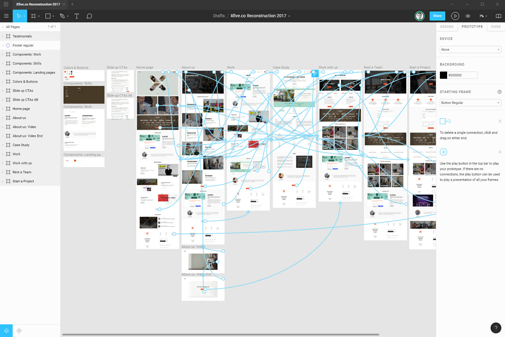

已經寫好的程式、做好的操作頁面，又要砍掉重練令人覺得困擾，特別是在距離專案上線時間愈來愈近的時候，如果要把一部分的功能砍掉重練，過程可能是伴隨著無止盡地加班，同時也累積愈來愈多技術債。

「上次不是確認過了嗎？為什麼這個又要改？」

軟體持續地修改其實很正常，打開你的電腦或手機，每天常用的應用軟體到作業系統，不斷升級改版推出新介面加入新功能，而且愈來愈頻繁，身為用戶的你不只已經習慣這件事，甚至可能還有點期待。

所以軟體開發團隊需要「敏捷」，才能跟得上市場的腳步。

根據專案金三角，只要客戶願意拿出更多預算、給予更多時間，軟體開發團隊就必須有能力交付品質更好、功能更多的成果，其中也包含根據客戶想法回饋帶來的修改。

有些修改會讓工程師覺得「沒有意義」，其實站在客戶的立場想，往往也是覺得百般無奈。

如果你今天賣的是早午餐，客戶覺得蛋餅不夠辣，你只要多撒點胡椒或辣椒粉，或是給他一罐甜辣醬，就能很快調整成客戶想要的口味，就算不小心加得太過辣，重新再做一份蛋餅也不是難事。

但是開發軟體要複雜許多，雖然開發軟體的過程，只需要電腦和網路，但是「軟體工程」的複雜程度，其實與現實生活中的「建築裝修」比較接近，規模也是有大有小，例如摩天大樓、別墅到小木屋，或是室內的重新裝潢。

這個比喻你就不難想像，不管今天客戶要蓋的是大樓還是小木屋，你都不可能先花三年或三個月，把房子依照客戶對想象的描述先蓋好後，才去問客戶這是不是你想要的房子？如果客戶這時候才說：「地下室要多一層」或者「每一層高度要多15公分」，這個專案就只能宣告失敗收場。

室內設計師常用 AutoCAD 之類的軟體，繪製 2D 平面圖與客戶溝通需求，接著再以 SketchUp 之類的軟體，繪製 3D 模型讓客戶看到更具體的設計，接著再加上材質和光源渲染成高度擬真的照片，讓客戶確認這就是自己想要的成果。雖然這個過程需要更多時間和成本，但是可以讓各方（室內設計師、業主和工班）盡可能先溝通清楚，大幅降低施工後才發現不符需求必須修改的風險。

現代軟體工程也是如此，我們透過 Wireframe 溝通需求，以 Mockup 確認 UI 細節與視覺風格，接下來還有個重要步驟，就是提供 Prototype 給使用者進行測試與確認。

多數的使用者畢竟不一定有軟體開發經驗或相關背景，有非常多想法與問題發現，都必須看到實際的畫面、實際操作過才能提出具體的意見，因此作為軟體開發團隊的成員，你必須在過程中協助確保你拿到的設計稿與規格，確實能夠滿足使用者的實際需求，包括在規劃與設計的過程中，依照實作技術方面的考量提出適當建議。

## 真實用戶回饋

經過一番折騰，在沒有設計師的協助下，幾個重要功能的 Mockup 終於完成。

強哥：「明天產品部找了三十位受測者來填問卷，有沒有機會讓他們對這個新系統也能給點意見？」

小美：「把這些畫面印出來給他們看嗎？」

「我們需要讓畫面可以操作，從登入開始，讓使用者根據他們自己的想法，決定點哪些按鈕、進行哪些操作。」

強哥：「哇賽～你們明天就能把這幾個功能都做完？」

「當然不是啦！」

「我們只要把 Mokcup 完成的 UI 製作成原型，就可以在手機上操作。」

小美：「要怎麼開始呢？」

## 練習時間

選出一條前後有關連的流程，至少包含三個以上畫面，製作成可以在手機上互動操作的原型（Prototyping），並找小組內的其他學員幫你實際測試一遍，提供你至少一則改善用戶體驗的建議。
